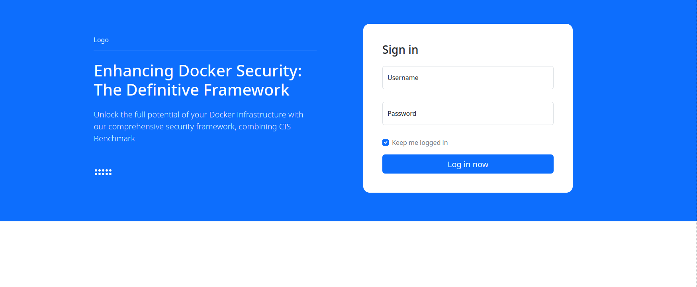
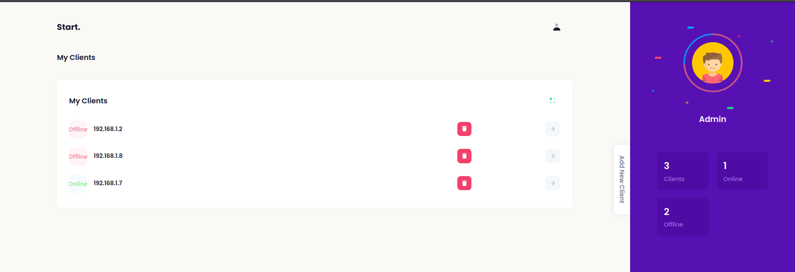
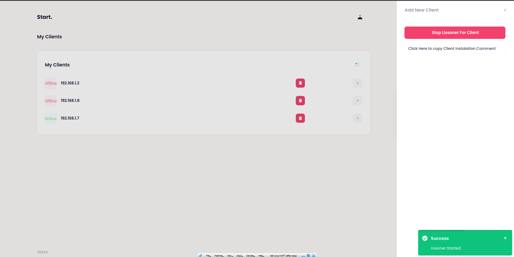
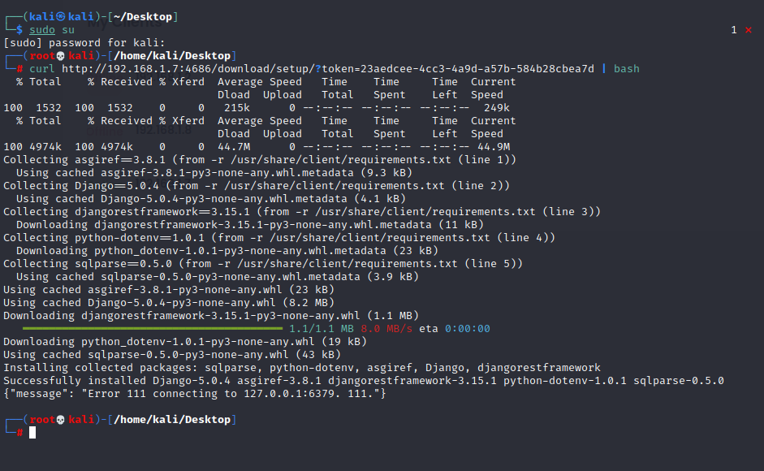
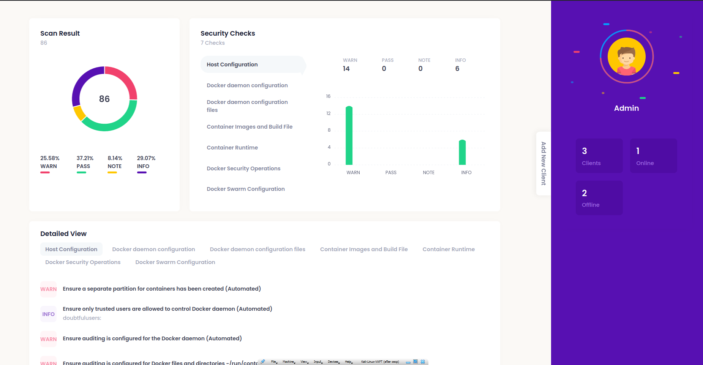

# SecureDock: Centralized Docker Security Management Platform

SecureDock is a centralized platform designed for managing and securing Docker environments. By leveraging the CIS Docker Benchmark, SecureDock scans Docker environments on client machines, initiated and managed from a centralized server. It provides real-time updates on client statuses and generates detailed visualizations of scan results.

---

## Features

- **Centralized Management**: Deploy, manage, and monitor multiple clients from a single server interface.
- **CIS Docker Benchmark**: Ensures Docker environments are compliant with security best practices.
- **Real-Time Status Monitoring**: Tracks client machines as online or offline in real-time.
- **Visualization**: Displays scan results in an easy-to-understand interface.

---

## Prerequisites

- Public or private IP for server deployment
- Root access on client machines
- Docker installed on clients

---

## Installation

### Server Setup

1. Clone the repository:
   ```bash
   git clone https://github.com/sharathc213/SecureDock.git
   cd SecureDock
   ```

2. Run the setup script:
   ```bash
   sudo bash run.sh
   ```
   - The script will prompt you to provide an IP and port for the server.
   - Use a public IP or the `eth0` IP for local setups, and choose any available port.

3. Once complete, the server service will be active and accessible on the provided IP and port.

### Accessing the Server Interface

1. Open a browser and navigate to:
   ```
   http://<server_ip>:<port>
   ```

2. Log in with the default credentials:
   - **Username**: `admin`
   - **Password**: `admin`


---

## Client Deployment

1. Log in to the server interface.
2. Click on the **Add New Client** button.
3. Start the listener for the client by clicking **Start Listener for Client**(the Listener only active for few mins for security reasons).
4. Copy the provided client installation command.
5. Execute the command on the client machine as root.
6. The server will automatically detect the client and display its status.

---

## Scanning a Client

1. Select the client from the server interface.
2. Click the **->** button.
3. The scan will run the CIS Docker Benchmark on the client machine.
4. Results will be sent back to the server and visualized in the dashboard.

---

## Screenshots

### 1. Server Interface Login


### 2. Dashboard Showing Online/Offline Clients


### 3. Adding a New Client



### 4. Visualization of Scan Results


---

## Notes

- Ensure the server and clients have sufficient permissions and network access for communication.
- Always keep the SecureDock repository updated for the latest security features and bug fixes.
- The server must remain online for real-time client status updates.

---

## Troubleshooting

1. **Server Not Starting:**
   - Verify the IP and port provided during setup.
   - Check if the required port is open and not blocked by a firewall.

2. **Client Not Detected:**
   - Ensure the client installation command was executed correctly.
   - Verify network connectivity between the client and server.

3. **Benchmark Scan Fails:**
   - Check Docker installation on the client.
   - Ensure the client machine has sufficient permissions to run the benchmark.

---

